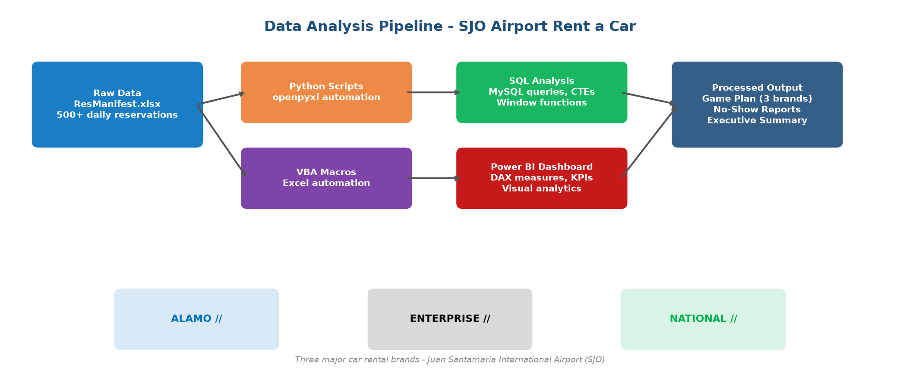

# Data Analytics Portfolio — Enterprise Holdings

<p align="center">
  
</p>

<p align="center">
  <strong>Data Pipeline & Business Intelligence</strong><br>
  Juan Santamaria International Airport (SJO) · Costa Rica
</p>

<p align="center">
  
  
  
  
</p>

---

## Overview

Portfolio of real-world data analysis and automation projects developed at **Enterprise Holdings** (Alamo, Enterprise, National) at SJO Airport. These tools process **500+ daily reservations**, automate operational reports, analyze No-Show patterns, and generate executive dashboards — turning **2+ hours of manual work into 15 minutes** of automated processing.

### Key Results

| Metric | Before | After | Improvement |
|--------|--------|-------|-------------|
| Daily Game Plan | 2 hours manual | 15 min automated | 87.5% faster |
| Reservations processed/day | Manual copy-paste | 500+ automated | Fully automated |
| Brand consolidation | 3 separate files | 1 file, 3 tabs | Unified |
| No-Show analysis | Did not exist | Daily automated report | New capability |
| Executive reporting | Game Plan only | Full BI dashboard | Enhanced |

---

## Projects

| Project | Description | Stack |
|---------|-------------|-------|
| [**SQL Portfolio**](./SQL_Portfolio/) | Database schema, Game Plan queries, No-Show analysis, executive reporting | `MySQL` `CTEs` |
| [**GamePlan Reservas**](./GamePlan_Reservas/) | Automated daily processing to 3-tab Excel (Alamo/Enterprise/National) | `Python` `VBA` |
| [**NoShow Reporte**](./NoShow_Reporte/) | Automated No-Show report with brand grouping and conditional formatting | `Python` `VBA` |
| [**Power BI Dashboard**](./PowerBI_Dashboard/) | 4-page interactive dashboard with DAX measures and KPIs | `DAX` `Power Query` |
| [**Vuelos SJO**](./Vuelos_SJO/) | International flight processing and hourly block categorization | `Python` `VBA` |
| [**Guias**](./Guias/) | Documentation and AI prompts for report automation | `Prompt Engineering` |

---

## Tech Stack

| Category | Technologies |
|----------|-------------|
| **Languages** | Python, SQL, VBA (Excel Macros) |
| **Libraries** | openpyxl, pandas, matplotlib, numpy |
| **Databases** | MySQL 8.0, MariaDB |
| **BI & Visualization** | Power BI Desktop, DAX, Power Query |
| **Automation** | Excel VBA, Python scripting, Batch processing |
| **Version Control** | Git, GitHub |

---

## Sample SQL Query

```sql
SELECT 
    ROW_NUMBER() OVER (PARTITION BY m.nombre_marca ORDER BY r.fecha_recogida) AS letra,
    r.numero_reserva,
    CONCAT(m.nombre_marca, '//') AS marca,
    CASE 
        WHEN r.es_vip = TRUE THEN '* MAIN VIP*'
        WHEN r.agencia LIKE '%11617270%' THEN '* EXPEDIA*'
        ELSE ''
    END AS tipo_vip,
    r.nombre_cliente,
    DATE_FORMAT(r.fecha_recogida, '%H:%i') AS hora_recogida
FROM reservas r
JOIN marcas m ON r.marca_id = m.marca_id
WHERE DATE(r.fecha_recogida) = CURDATE() AND r.estado = 'activa'
ORDER BY m.nombre_marca, r.nombre_cliente;
```

---

## Getting Started

Each project folder contains detailed setup and usage instructions.

```bash
# Run the complete SQL portfolio (requires MySQL 8.0+)
mysql -u root -p < SQL_Portfolio/portfolio_completo.sql
```

---

## Author

**Jose Andres Sequeira Hernandez**  
Data Analyst · Business Intelligence  

[chomita0317@gmail.com](mailto:chomita0317@gmail.com)  
[LinkedIn](https://linkedin.com/in/joseandres-sequeira-hernandez-3aaa03285) · [GitHub](https://github.com/JoseAn03)

---

<p align="center">
  <em>"Turning raw reservation data into actionable insights — one query at a time."</em>
</p>
