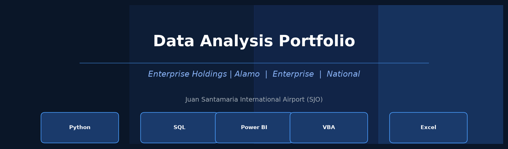

<div align="center">
  
  <br><br>
  
  [](https://python.org)
  [](https://mysql.com)
  [](https://powerbi.microsoft.com)
  [](https://microsoft.com/excel)
  [](https://github.com/JoseAn03)
  [](https://linkedin.com/in/joseandres-sequeira-hernandez-3aaa03285)
</div>

<br>

---

## 📊 Overview

Real-world data analysis projects developed at **Enterprise Holdings** processing 500+ daily reservations across **Alamo**, **Enterprise**, and **National** at Juan Santamaria International Airport (SJO). These tools automate operational reports, analyze No-Show patterns, generate executive dashboards, and process flight data.

### 🎯 Key Results

| Metric | Before | After | Improvement |
|--------|--------|-------|-------------|
| Daily Game Plan generation | 2 hours | **15 minutes** | ⚡ 87.5% faster |
| Reservations processed/day | Manual copy-paste | **500+ automated** | ✅ Fully automated |
| Brand consolidation | 3 separate files | **1 file, 3 tabs** | 📂 Unified |
| No-Show analysis | Did not exist | **Automated daily report** | 🆕 New capability |
| Executive reporting | Game Plan only | **Full BI dashboard** | 📈 Enhanced |
| Resume processing time | 2 hours | 15 minutes | ⚡ 87.5% reduction |

---

## 📂 Projects

<table>
  <thead>
    <tr>
      <th width="180">Project</th>
      <th>Description</th>
      <th width="120">Tech Stack</th>
    </tr>
  </thead>
  <tbody>
    <tr>
      <td><strong><a href="./SQL_Portfolio/">SQL Portfolio</a></strong></td>
      <td>MySQL schema, daily Game Plan queries, No-Show analysis, executive reports, VIP/Expedia detection. Includes CTEs, window functions, and complex aggregations.</td>
      <td><code>MySQL</code> <code>CTEs</code></td>
    </tr>
    <tr>
      <td><strong><a href="./GamePlan_Reservas/">GamePlan Reservas</a></strong></td>
      <td>Automated daily reservation processing into formatted 3-tab Excel workbook with brand-specific conditional formatting and A-Z letter grouping.</td>
      <td><code>Python</code> <code>VBA</code></td>
    </tr>
    <tr>
      <td><strong><a href="./NoShow_Reporte/">NoShow Reporte</a></strong></td>
      <td>Automated No-Show report with brand classification, alphabetical sorting, and VIP/Expedia detection.</td>
      <td><code>Python</code> <code>VBA</code></td>
    </tr>
    <tr>
      <td><strong><a href="./PowerBI_Dashboard/">Power BI Dashboard</a></strong></td>
      <td>4-page interactive dashboard: Executive Summary, Brand Analysis, Hourly Patterns, No-Show Tracking with custom DAX measures.</td>
      <td><code>DAX</code> <code>Power Query</code></td>
    </tr>
    <tr>
      <td><strong><a href="./Vuelos_SJO/">Vuelos SJO</a></strong></td>
      <td>International flight data processing with airline filtering, domestic exclusion, and hourly block categorization.</td>
      <td><code>Python</code> <code>VBA</code></td>
    </tr>
    <tr>
      <td><strong><a href="./Guias/">Guias</a></strong></td>
      <td>Documentation and AI prompts for streamlined report generation and process automation.</td>
      <td><code>Prompt Engineering</code></td>
    </tr>
  </tbody>
</table>

---

## 🛠️ Technology Stack

<div align="center">

| Category | Technologies |
|----------|-------------|
| **Languages** | Python, SQL, VBA |
| **Libraries** | openpyxl, pandas, matplotlib, numpy |
| **Databases** | MySQL 8.0, MariaDB |
| **BI & Visualization** | Power BI Desktop, DAX, Power Query |
| **Automation** | Excel VBA, Python scripting, batch processing |
| **Version Control** | Git, GitHub |

</div>

---

## 🚀 Getting Started

Each project folder contains its own detailed README with setup and usage instructions.

**Quick example** — run the complete SQL portfolio locally:

```bash
# Requires MySQL 8.0+ or MariaDB 10.5+
mysql -u root -p < SQL_Portfolio/portfolio_completo.sql
```

---

## 👨‍💻 Author

**Jose Andres Sequeira Hernandez**  
Data Analyst | Business Intelligence

<div align="center">
  <a href="https://linkedin.com/in/joseandres-sequeira-hernandez-3aaa03285">
    
  </a>
  <a href="mailto:chomita0317@gmail.com">
    
  </a>
  <a href="https://github.com/JoseAn03">
    
  </a>
</div>

---

<p align="center">
  <i>Turning raw reservation data into actionable insights — one query at a time.</i>
</p>
